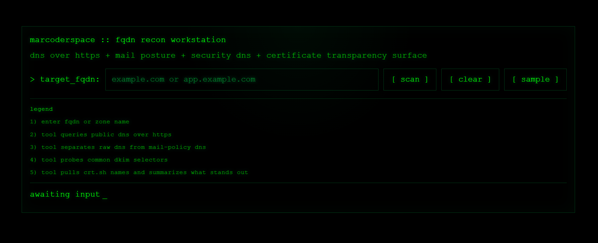

# FQDN Recon Workstation

A browser-based tool for collecting and correlating DNS data, mail-related signals, and certificate transparency records for a given domain.

## Overview

This tool takes a fully qualified domain name and performs a series of queries against public infrastructure to build a consolidated view of externally observable signals.

All logic runs directly in the browser, without any backend.

## Design intent

The tool is designed around the idea that understanding an external surface begins with observing signals, not blindly scanning endpoints.

## How it works

### 1. DNS data collection

The tool queries DNS records using DNS over HTTPS.

Record types:
- A, AAAA (address resolution)
- CNAME (aliasing)
- MX (mail routing)
- NS (nameservers)
- TXT (generic metadata and policies)
- SOA, CAA

Each record set is retrieved independently and normalized into a consistent structure.

---

### 2. Mail and policy signals

The tool inspects DNS-based policy signals related to email and domain configuration:

- SPF (via TXT on root domain)
- DMARC (via `_dmarc.<domain>`)
- MTA-STS (via `_mta-sts.<domain>`)
- BIMI (via `default._bimi.<domain>`)

Additionally, it performs targeted probing for common DKIM selectors:
- default, google, selector1, selector2, etc.

These checks provide a quick view of whether standard mail-related controls are present.

---

### 3. Certificate Transparency data

The tool queries crt.sh for certificate transparency entries related to the domain.

From the returned data it:
- extracts unique hostnames
- removes wildcards
- counts total entries
- identifies issuing certificate authorities

This provides visibility into publicly issued certificates and indirectly into exposed hostnames.

---

### 4. Data aggregation

Collected data is grouped into:

- DNS core records
- Mail and policy signals
- Certificate transparency findings

A summary layer extracts simple metrics such as:
- record counts
- presence of specific signals
- number of discovered names

---

### 5. Derived observations

Based on collected data, the tool generates simple observations, for example:

- whether the domain resolves directly or via alias
- whether mail routing is configured
- presence or absence of SPF / DMARC / DKIM
- indications of broader hostname surface from CT data
- patterns suggesting staging, dev, or mail-related services

These are heuristic and intended for quick orientation, not definitive conclusions.

---

## What this is useful for

- Quickly understanding what is externally visible for a domain
- Identifying missing or present DNS and mail-related signals
- Getting an initial view of hostname exposure via certificate transparency
- Supporting manual reconnaissance and investigation workflows

---

## Files

- index.html

## Usage

Open `index.html` in a browser.

Enter a domain and run the scan.

## Notes

- Relies on public services such as DNS over HTTPS and crt.sh
- Results depend on network conditions and external service availability
- Some requests may be limited by browser security policies

## Status

Experimental

## Data sources and mechanisms

The tool relies entirely on publicly accessible infrastructure and browser-native capabilities.

### DNS over HTTPS (DoH)

DNS queries are performed using DNS over HTTPS against public resolvers.

Instead of using the system resolver, the tool sends HTTPS requests to a DoH endpoint and receives DNS responses in JSON format.

This approach allows:
- direct DNS querying from the browser
- consistent response structure across environments
- avoidance of local resolver differences

---

### TXT-based policy discovery

Several domain-level controls are published via DNS TXT records.

The tool queries specific hostnames and filters TXT values based on known patterns:

- SPF → `v=spf1`
- DMARC → `v=DMARC1`
- MTA-STS → `v=STSv1`
- BIMI → `v=BIMI1`
- DKIM → `v=DKIM1`

This is essentially pattern-based extraction from raw TXT records.

---

### Certificate Transparency (CT)

Certificate data is retrieved from public CT log aggregators.

The tool queries crt.sh and processes returned JSON data to extract:

- certificate names (SAN and common name)
- unique hostnames
- issuing authorities

CT logs provide a near real-time record of publicly issued certificates and are a strong signal of externally exposed names.

---

### Browser execution model

All requests are executed directly from the browser using the Fetch API.

Implications:

- no server-side processing
- no persistent storage
- subject to CORS and browser security policies
- dependent on availability of public endpoints

---

### Data normalization

Raw responses from different sources are normalized into simple structures:

- record lists for DNS
- filtered values for policy signals
- deduplicated hostname sets for CT

This enables consistent rendering and basic aggregation across heterogeneous sources.
