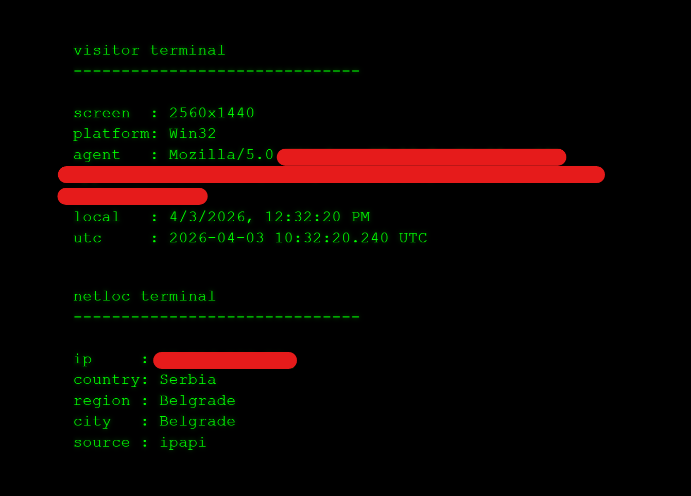

# Visitor Netloc Terminal

A browser-based dual-terminal interface that displays client environment details and performs basic network location lookup.

## Overview

This is a single-file implementation that renders two terminal-style panels:

- Visitor terminal showing browser and system information
- Netloc terminal showing IP and geolocation data retrieved from public endpoints

The layout is responsive and automatically adjusts font size to fit the available space.

## Features

- Displays screen resolution, platform, and user agent
- Shows local time and UTC time
- Performs IP and geolocation lookup using multiple public APIs
- Fallback handling if lookup fails
- Dual-terminal layout with synchronized font scaling
- Fully browser-native, no dependencies

## Files

- index.html

## Usage

Open `index.html` in a browser.

## Notes

- Geolocation depends on availability of external services
- Results may vary depending on network, browser, and client environment
- Some browsers may restrict requests due to CORS or privacy settings

## Status

Experimental
